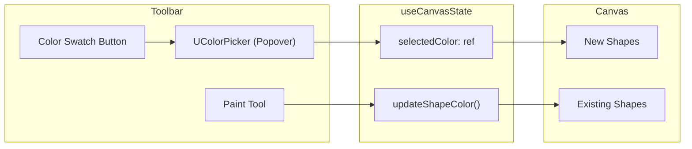

# Color Picker and Paint Tool Feature

## Overview

Add a color picker integrated into the toolbar and a paint bucket tool to change colors of existing shapes. The color picker will use Nuxt UI's `UColorPicker` component in a popover.

## Architecture



## File Changes

### 1. Update types - [app/types/canvas.ts](app/types/canvas.ts)

Add `fill` property to `BaseShape` and `paint` to `ToolMode`:

```typescript
export interface BaseShape {
  id: string
  x: number
  y: number
  type: 'square' | 'triangle' | 'circle'
  width?: number
  height?: number
  radius?: number
  fill: string  // NEW: hex color
}

export type ToolMode = 'pan' | 'select' | 'square' | 'triangle' | 'circle' | 'line' | 'delete' | 'paint'
```

### 2. Update state - [app/composables/useCanvasState.ts](app/composables/useCanvasState.ts)

- Add `selectedColor` ref with default `#60a5fa` (current blue)
- Modify `addShape()` to accept and store the selected color
- Add `updateShapeColor(id, color)` function
- Handle paint tool clicks in `handleShapeClick()`

### 3. Create paint icon - `app/components/icons/PaintIcon.vue`

New SVG icon (paint bucket style) matching existing icon patterns.

### 4. Update toolbar - [app/components/ShapeToolbar.vue](app/components/ShapeToolbar.vue)

- Add props: `selectedColor` and emit `color-change`
- Add color swatch button that opens `UPopover` with `UColorPicker`
- Add paint tool button after the delete tool (or in a logical position)
- Color swatch shows the current selected color as a preview

### 5. Update canvas rendering - [app/components/CanvasEditor.vue](app/components/CanvasEditor.vue)

- Replace hardcoded `#60a5fa` with `shape.fill`
- Keep selection highlight behavior (darker shade or border emphasis)

### 6. Update workspace - [app/components/CanvasWorkspace.vue](app/components/CanvasWorkspace.vue)

- Pass `selectedColor` to toolbar
- Handle `color-change` event

## UI Design

The color picker will appear as:

- A small circular swatch button showing the current color
- Click opens a popover with the Nuxt UI color picker
- Positioned in the toolbar after the divider, before the paint tool

Default color: `#60a5fa` (matching current shape color)

## Paint Tool Behavior

- When paint tool is active, cursor changes (custom or crosshair)
- Click on a shape to apply the selected color
- Stay in paint mode to allow multiple recolors