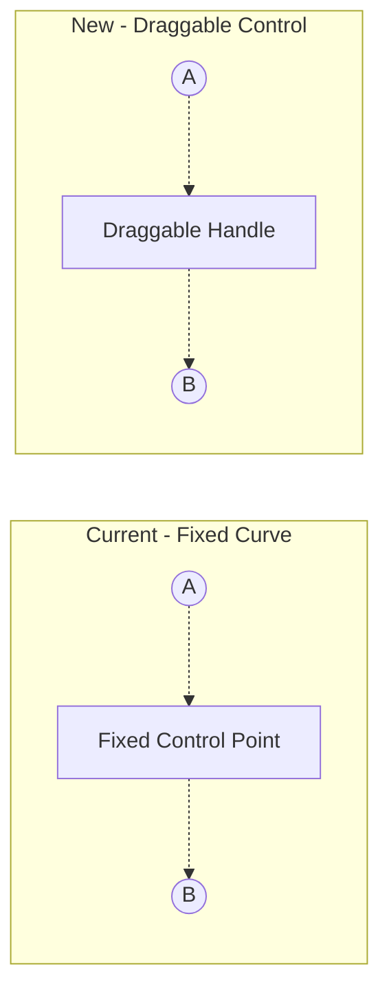

# Draggable Curve Control Points

## Problem

Currently, curved lines have a fixed perpendicular offset (30% of line length, always in one direction). Users cannot:

- Flip the curve direction (inward vs outward)
- Control the curve intensity
- Create perfect circular paths with shapes arranged in different configurations

## Solution

Add a draggable control point handle at the center of each curved line. Dragging this handle adjusts both the direction and intensity of the curve.



## File Changes

### 1. [app/types/canvas.ts](app/types/canvas.ts)

Replace `curved: boolean` with `curveOffset` to store the control point position:

```typescript
export interface Connection {
  id: string
  fromShapeId: string
  toShapeId: string
  fromAnchor: ConnectionAnchor
  toAnchor: ConnectionAnchor
  stroke: string
  // null = straight line, { x, y } = offset from midpoint for curve control
  curveOffset: { x: number; y: number } | null
}
```

### 2. [app/composables/useCanvasState.ts](app/composables/useCanvasState.ts)

- Update `addConnection()` to set initial `curveOffset`:
  - For straight lines (`'line'` tool): `curveOffset: null`
  - For curved lines (`'curved-line'` tool): Calculate default perpendicular offset
- Add `updateConnectionCurveOffset(id, offset)` function to update the control point position
- Remove references to the old `curved` boolean

### 3. [app/components/CanvasEditor.vue](app/components/CanvasEditor.vue)

**Update `linePositions` computed:**

- Check `conn.curveOffset !== null` instead of `conn.curved`
- Use `conn.curveOffset` directly as the control point offset from midpoint

**Add `curveControlHandle` computed:**

- When a curved connection is selected, compute the control point position
- Return handle position for rendering

**Add curve control point rendering (in template):**

```vue
<!-- Curve Control Handle (when curved line is selected) -->
<VCircle
  v-if="curveControlHandle"
  :config="{
    x: curveControlHandle.x,
    y: curveControlHandle.y,
    radius: 6,
    fill: '#3b82f6',
    stroke: '#1d4ed8',
    strokeWidth: 2,
    draggable: true,
  }"
  @dragmove="handleCurveControlDrag"
  @dragend="handleCurveControlDragEnd"
/>
```

**Add drag handlers:**

- `handleCurveControlDrag`: Update curve offset in real-time during drag
- `handleCurveControlDragEnd`: Finalize the offset

**Update endpoint handles:**

- Add the curve control handle to the handles layer alongside existing from/to endpoint handles

### 4. Default Curve Calculation

When creating a new curved line, calculate a sensible default offset:

```typescript
function calculateDefaultCurveOffset(from: Point, to: Point): { x: number; y: number } {
  const dx = to.x - from.x
  const dy = to.y - from.y
  const len = Math.sqrt(dx * dx + dy * dy)
  if (len === 0) return { x: 0, y: 0 }
  
  // Default: 30% of line length, perpendicular direction
  const offset = len * 0.3
  return {
    x: -dy / len * offset,
    y: dx / len * offset
  }
}
```

## User Interaction Flow

1. Select the curved line tool and connect two shapes - line appears with default curve
2. Click on the curved line to select it - control point handle appears at curve apex
3. Drag the handle inward/outward - curve direction and intensity change in real-time
4. Release to finalize - offset is saved to the connection

## Result

- Users can flip curve direction by dragging the control point to the opposite side
- Users can adjust curve intensity by dragging closer to or further from the line
- Perfect circles become achievable by fine-tuning each curve's control point
- Straight lines remain straight (curveOffset: null)