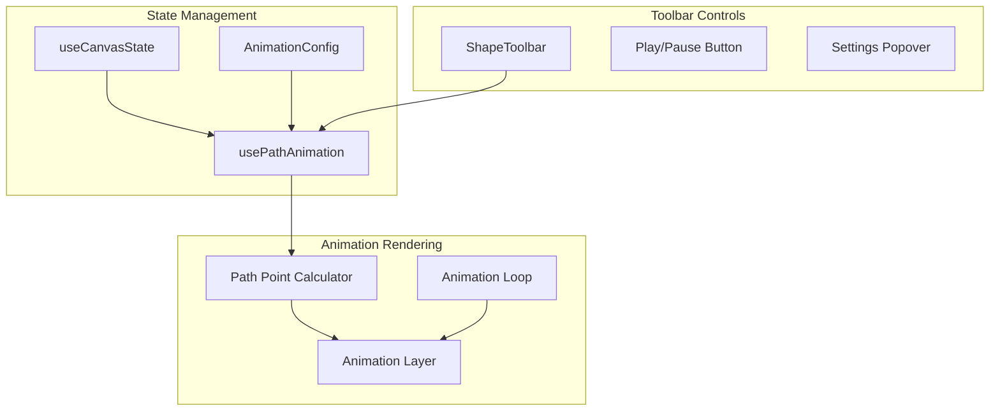
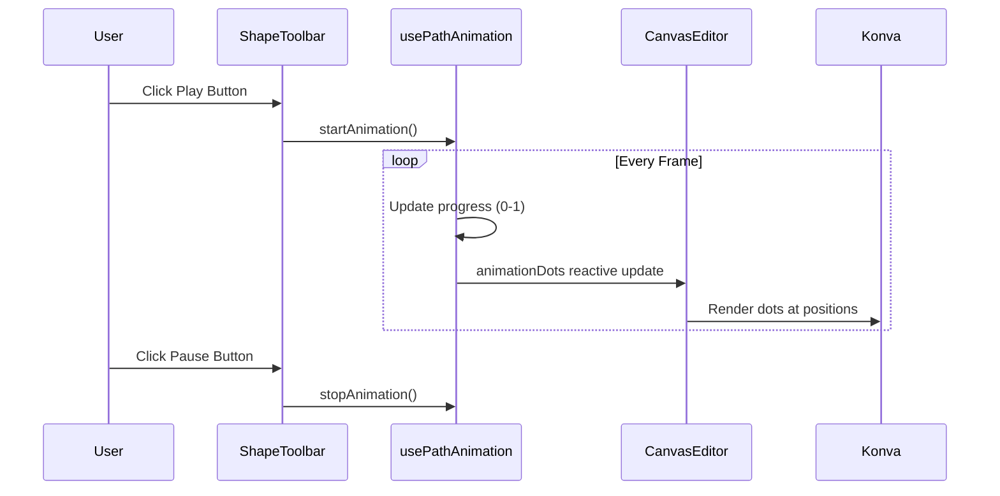

# Line Path Animation Feature

## Overview

Add an animation system that allows a visual indicator (dot/marker) to travel along connected line paths, creating a loading spinner effect. The animation will orbit through shapes connected by lines (straight or curved).

## Architecture



## Key Files to Modify/Create

1. **[app/types/canvas.ts](app/types/canvas.ts)** - Add animation types
2. **[app/composables/usePathAnimation.ts](app/composables/usePathAnimation.ts)** (new) - Animation logic and state
3. **[app/components/CanvasEditor.vue](app/components/CanvasEditor.vue)** - Add animation rendering layer
4. **[app/components/ShapeToolbar.vue](app/components/ShapeToolbar.vue)** - Add animation button with popover controls
5. **[app/components/CanvasWorkspace.vue](app/components/CanvasWorkspace.vue)** - Wire up animation state

## Implementation Details

### 1. Animation Types

Add to `canvas.ts`:

```typescript
export interface AnimationConfig {
  enabled: boolean
  speed: number  // 0.5 to 3.0 multiplier
  dotSize: number
  dotColor: string
  trailLength: number  // 0 = no trail, 1 = full path
}
```

### 2. Path Animation Composable

New `usePathAnimation.ts` will:

- Track animation state (playing, progress 0-1)
- Calculate point position along path at any progress value
- Handle both straight lines and quadratic bezier curves
- Use `requestAnimationFrame` for smooth 60fps animation
- Support path traversal calculation using parametric equations

Key functions:

- `getPointOnPath(connection, progress)` - Returns {x, y} at progress (0-1) along path
- `calculatePathLength(connection)` - Total pixel length for consistent speed
- `startAnimation()` / `stopAnimation()` - Control animation loop

### 3. Path Point Calculation

For **straight lines**: Linear interpolation between endpoints

```typescript
x = from.x + (to.x - from.x) * t
y = from.y + (to.y - from.y) * t
```

For **curved lines** (quadratic bezier with control point):

```typescript
x = (1-t)^2 * from.x + 2*(1-t)*t * control.x + t^2 * to.x
y = (1-t)^2 * from.y + 2*(1-t)*t * control.y + t^2 * to.y
```

### 4. Animation Rendering

Add new VLayer in `CanvasEditor.vue` after the lines layer:

```vue
<!-- Animation Layer -->
<VLayer name="animationLayer" v-if="isAnimating">
  <VCircle
    v-for="dot in animationDots"
    :config="{
      x: dot.x,
      y: dot.y,
      radius: animationConfig.dotSize,
      fill: animationConfig.dotColor,
      shadowBlur: 10,
      shadowColor: animationConfig.dotColor,
    }"
  />
</VLayer>
```

### 5. Toolbar Animation Controls

Add to ShapeToolbar after the delete button:

- **Play/Pause button** - Icon toggles between play and pause states
- **Popover with settings** (opens via chevron or long-press):
  - Speed slider (0.5x to 3x)
  - Dot size control  
  - Color picker for animation dot
- Button is disabled when no connections exist
```vue
<!-- Animation control in toolbar -->
<UPopover>
  <button
    :class="[
      'p-2 rounded-lg transition-colors',
      isAnimating ? 'bg-green-900 text-green-400' : 'hover:bg-gray-800 text-gray-300'
    ]"
    :disabled="!hasConnections"
    @click="toggleAnimation"
  >
    <PlayIcon v-if="!isAnimating" />
    <PauseIcon v-else />
  </button>
  
  <template #content>
    <div class="p-3 space-y-3">
      <label>Speed</label>
      <input type="range" min="0.5" max="3" step="0.1" />
      <label>Dot Size</label>
      <input type="range" min="4" max="16" />
      <UColorPicker v-model="dotColor" />
    </div>
  </template>
</UPopover>
```


## Data Flow



## Animation Behavior

1. **Single Connection**: Dot travels from shape A to shape B, then reverses (ping-pong) or loops back instantly
2. **Connected Loop**: Dot continuously orbits through the connected path
3. **Multiple Connections**: Each connection gets its own animated dot, all moving in sync
4. **Speed**: Base duration of 2 seconds per connection, modified by speed multiplier