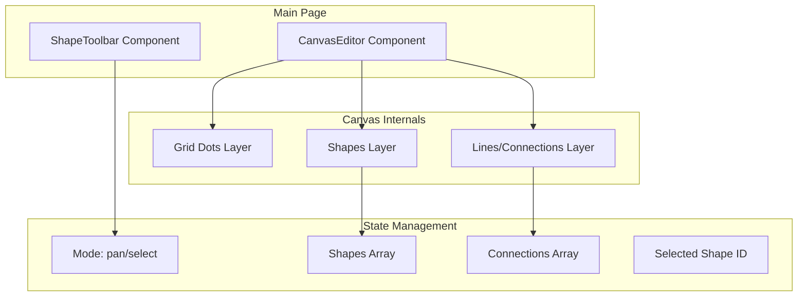

# Loading Indicator Canvas Editor

## Architecture Overview



## File Structure

```
app/
├── app.vue                    # Update to host the editor page
├── components/
│   ├── CanvasEditor.vue       # Main canvas with Konva stage
│   ├── ShapeToolbar.vue       # Bottom toolbar with shape options
│   └── icons/                 # SVG icons for toolbar
│       ├── HandIcon.vue
│       ├── SquareIcon.vue
│       ├── TriangleIcon.vue
│       ├── CircleIcon.vue
│       └── LineIcon.vue
├── composables/
│   └── useCanvasState.ts      # Shared state for shapes, mode, selection
└── types/
    └── canvas.ts              # TypeScript interfaces for shapes
```

## Key Implementation Details

### 1. Install Dependencies

```bash
bun add konva vue-konva
```

### 2. Type Definitions (`app/types/canvas.ts`)

```typescript
interface BaseShape {
  id: string
  x: number
  y: number
  type: 'square' | 'triangle' | 'circle'
}

interface Connection {
  id: string
  fromShapeId: string
  toShapeId: string
}

type ToolMode = 'pan' | 'select' | 'square' | 'triangle' | 'circle' | 'line'
```

### 3. Canvas State Composable (`app/composables/useCanvasState.ts`)

- Reactive state for: `shapes`, `connections`, `currentTool`, `selectedShapeId`
- Functions: `addShape()`, `removeShape()`, `addConnection()`, `setTool()`
- Pan/zoom state for canvas navigation

### 4. Canvas Editor Component (`app/components/CanvasEditor.vue`)

Uses `vue-konva` components:

- `v-stage` - Main Konva stage (full viewport)
- `v-layer` - Grid dots layer (static, light grey dots ~20px apart)
- `v-layer` - Shapes layer (draggable squares, triangles, circles)
- `v-layer` - Lines layer (connections between shapes)

Key behaviors:

- Click on canvas in shape mode → place shape at cursor
- Click on shape in select mode → select it (show selection indicator)
- Drag shape → update position
- Line tool: click shape A, then shape B → create connection

### 5. Shape Toolbar Component (`app/components/ShapeToolbar.vue`)

- Fixed position, bottom center, slight offset from viewport edge
- Horizontal pill-shaped container with subtle background
- Left: Hand icon (pan/select toggle)
- Divider
- Right: Square, Triangle, Circle, Line icons
- Active tool highlighted

### 6. Grid Rendering

Draw dots using Konva `v-circle` in a computed grid:

```typescript
const gridDots = computed(() => {
  const dots = []
  const spacing = 20
  for (let x = 0; x < stageWidth; x += spacing) {
    for (let y = 0; y < stageHeight; y += spacing) {
      dots.push({ x, y })
    }
  }
  return dots
})
```

## Styling

- Canvas background: Current app background (Nuxt UI default, likely `#ffffff` light / `#0a0a0a` dark)
- Grid dots: Light grey (`#e5e5e5` light / `#262626` dark)
- Toolbar: Semi-transparent backdrop blur, rounded corners, 8-12px from bottom
- Shapes: Default fills with subtle borders, highlighted stroke when selected