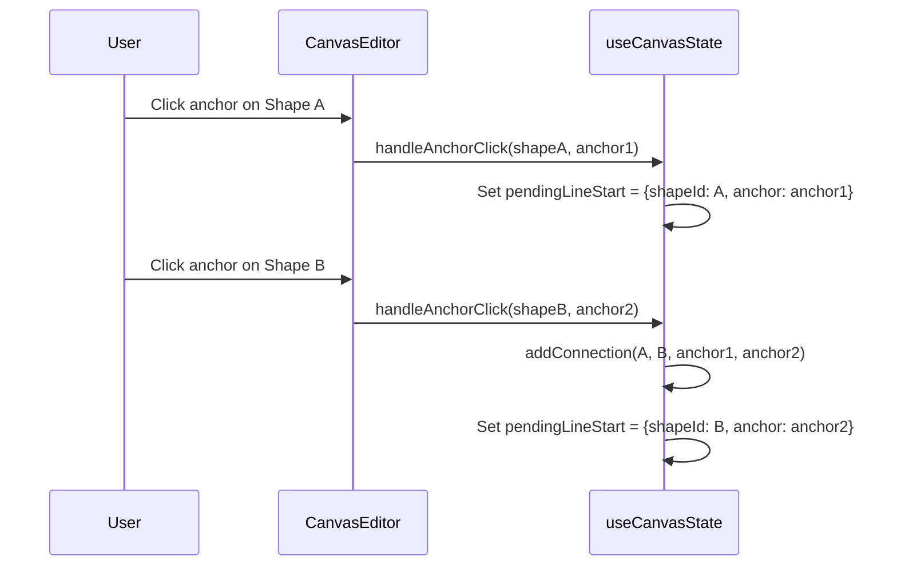

# Multiple Connections Between Shapes

## Problem

Currently, the `addConnection()` function in [`useCanvasState.ts`](app/composables/useCanvasState.ts) blocks any new connection between shapes that already have one, due to a duplicate prevention check at lines 273-277.

## Solution Overview

Allow users to click on specific anchor points when in line/curved-line mode, giving precise control over connection endpoints. Remove the blanket duplicate prevention.

## Key Changes

### 1. Update State Model

In [`useCanvasState.ts`](app/composables/useCanvasState.ts):

- Change `pendingLineStart` from `string | null` to store both shape ID and anchor:
```typescript
interface PendingLineStart {
  shapeId: string
  anchor: ConnectionAnchor
}
const pendingLineStart = ref<PendingLineStart | null>(null)
```


### 2. Remove Duplicate Prevention

In `addConnection()` function, remove lines 273-277 that prevent connections between already-connected shapes.

### 3. Modify Connection Creation

Update `addConnection()` to accept optional anchor parameters:

```typescript
function addConnection(
  fromShapeId: string,
  toShapeId: string,
  fromAnchorOverride?: ConnectionAnchor,
  toAnchorOverride?: ConnectionAnchor
)
```

Use overrides when provided, fall back to auto-calculation otherwise.

### 4. Update Click Handling

In [`CanvasEditor.vue`](app/components/CanvasEditor.vue):

- When clicking to start a line, detect if near an anchor point and store that anchor
- Make anchor point indicators clickable (not just visual)
- Add new handler `handleAnchorClick(shapeId, anchor)` for starting/ending lines from specific anchors

### 5. Visual Feedback

- Show anchor points on hovered shape (already implemented)
- Highlight the specific anchor being targeted when cursor is near
- Keep anchor points visible on pending line start shape

## Data Flow



## Files to Modify

- [`app/composables/useCanvasState.ts`](app/composables/useCanvasState.ts) - State management and connection logic
- [`app/components/CanvasEditor.vue`](app/components/CanvasEditor.vue) - Click handling and anchor interaction
- [`app/types/canvas.ts`](app/types/canvas.ts) - Add `PendingLineStart` interface (optional, can be inline)