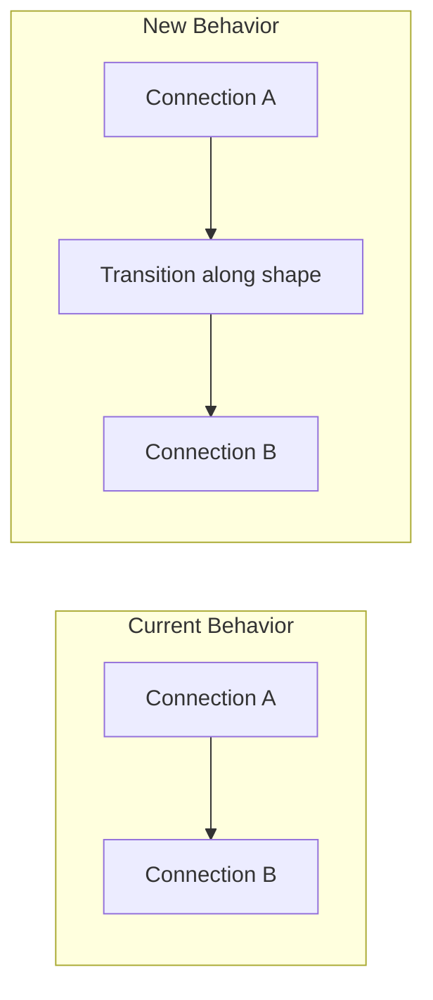

# Smooth Circuit Transitions

## Problem

When the animation dot completes one connection and moves to the next, it jumps instantly between anchor points:

```
Connection A ends at Shape X, anchor 0.3
Connection B starts at Shape X, anchor 0.7
--> Dot jumps from position 0.3 to 0.7 instantly
```

## Solution

Insert "transition segments" that travel along the shape's perimeter between the exit point of one connection and the entry point of the next.



## Implementation

### 1. Extend CircuitSegment type

In [`app/composables/usePathAnimation.ts`](app/composables/usePathAnimation.ts), modify the segment interface:

```typescript
interface CircuitSegment {
  type: 'connection' | 'transition'
  // For connection segments
  connection?: Connection
  reversed?: boolean
  // For transition segments  
  shape?: BaseShape
  fromAnchor?: number  // normalized 0-1
  toAnchor?: number    // normalized 0-1
  // Common
  startDistance: number
  endDistance: number
}
```

### 2. Add perimeter path calculation

Add a function to calculate points along a shape's perimeter:

```typescript
function getPointOnShapePerimeter(
  shape: BaseShape, 
  anchorPosition: number
): { x: number; y: number }
```

This can reuse the existing `getAnchorPosition` logic from `useCanvasState.ts`.

### 3. Add transition length calculation

Calculate the arc length along the perimeter between two anchor positions:

```typescript
function calculateTransitionLength(
  shape: BaseShape,
  fromAnchor: number,
  toAnchor: number
): number
```

For circles, this is straightforward (arc length). For squares/triangles, calculate perimeter distance.

### 4. Update buildCircuit()

After adding each connection segment, check if a transition is needed:

- Get the exit anchor of the current segment
- Get the entry anchor of the next segment  
- If they differ, insert a transition segment between them
- Choose the shorter path around the perimeter (clockwise vs counter-clockwise)

### 5. Update animate() to handle transitions

When the current segment is a transition, interpolate along the shape perimeter instead of along a connection path.

## Files to Modify

- [`app/composables/usePathAnimation.ts`](app/composables/usePathAnimation.ts) - All changes are in this file